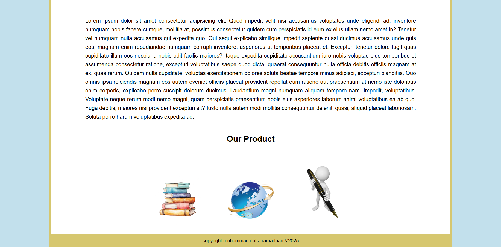

# Tugas 1 Web - Daffa

## Deskripsi
Website ini dibuat sebagai **tugas perkuliahan** untuk mata kuliah **Pemrograman Web**.  
Menampilkan halaman **Beranda, Produk, Galeri, dan Kontak**.

Semua halaman dibuat **menggunakan HTML dan CSS murni**, tanpa JavaScript atau library eksternal.

## Struktur Folder
/index.html        -> Halaman Beranda

/product.html      -> Halaman Produk

/gallery.html      -> Halaman Galeri

/contact.html      -> Halaman Kontak

/s_chart.html      -> Halaman S&Chart

/style.css         -> File CSS untuk styling

/images/           -> Folder untuk menyimpan gambar

## Cara Menjalankan
1. Clone atau download repository ini
2. Buka salah satu file `.html` di browser favoritmu.
   Contoh: `index.html`
3. Gunakan plugin live server (Alternatif dan Rekomended)

## Teknologi yang Digunakan

* HTML5
* CSS3
